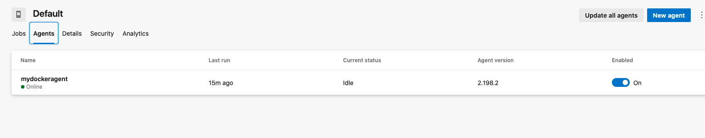

# docker-agent-azure-devops
Agente docker listo para self-hosted agent para Azure DevOps y netcore 3.1

### Tecnología Utilizada
- Azure DevOps 
- Docker
- Ubuntu 18.04

### Si te gusta el contenido del repositorio no olvides dejar una estrella! ⭐⭐⭐⭐

## 1. Hacer el build de la imagen docker
   !importante ubicarse en el directorio raiz donde se encuentran los archivos
 ```bash 
    docker build -t mydockeragent .
  ```
  
## 2. Iniciar contenedor a partir de imagen

  <br>
   Recuerda configurar las variables de entorno como:
  AZP_URL,
  AZP_TOKEN
 y  AZP_AGENT_NAME
   
 ```bash 
   docker run -e AZP_URL={AzureDevOpsURL}-e AZP_TOKEN={TOKEN} -e AZP_AGENT_NAME=mydockeragent mydockeragent:latest
  ```
 
 ### Listo a empezar a jugar con Azure DevOps y netcore
 
  <br>
  
